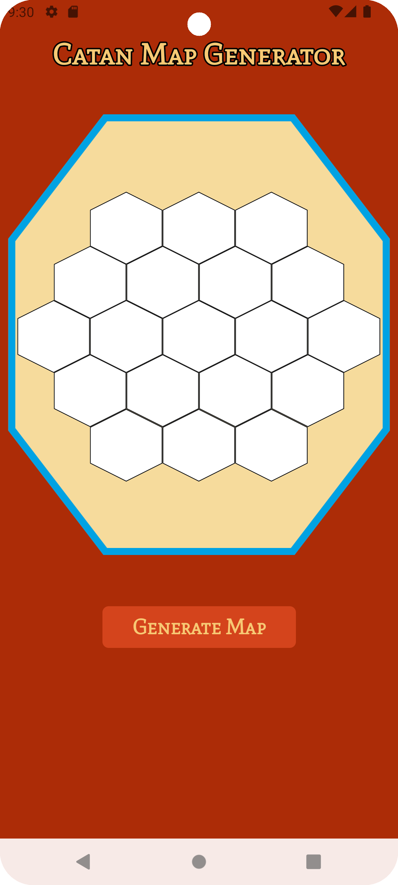
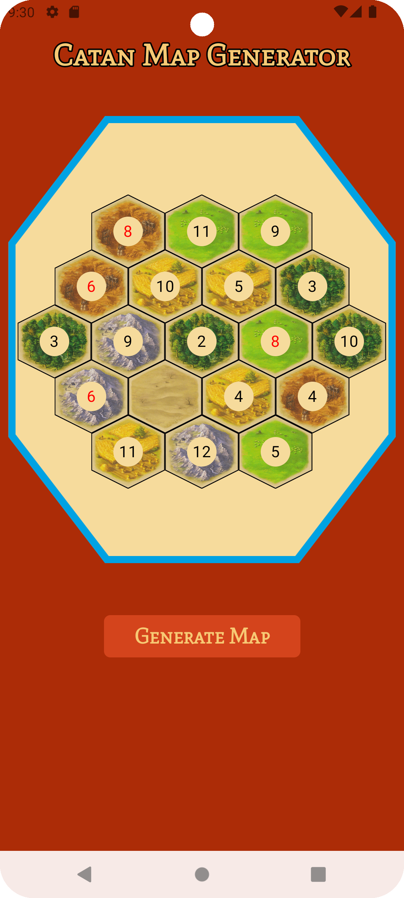

## **Catan Map Generator**

Catan Map Generator is a simple app designed to enhance your Catan board building experience. 

It can quickly generate random maps so that you can have a completely new world to conquer every time you play the game!


## **Screenshots**

<p align="middle">


</p>


## **Installation**

Download the latest version of Android Studio.

Clone this repository and open it.

Run the gradlew installDebug command:


````shell
./gradlew installDebug
````


## **License**

This project is under the MIT License. See the LICENSE.md file for more details.
